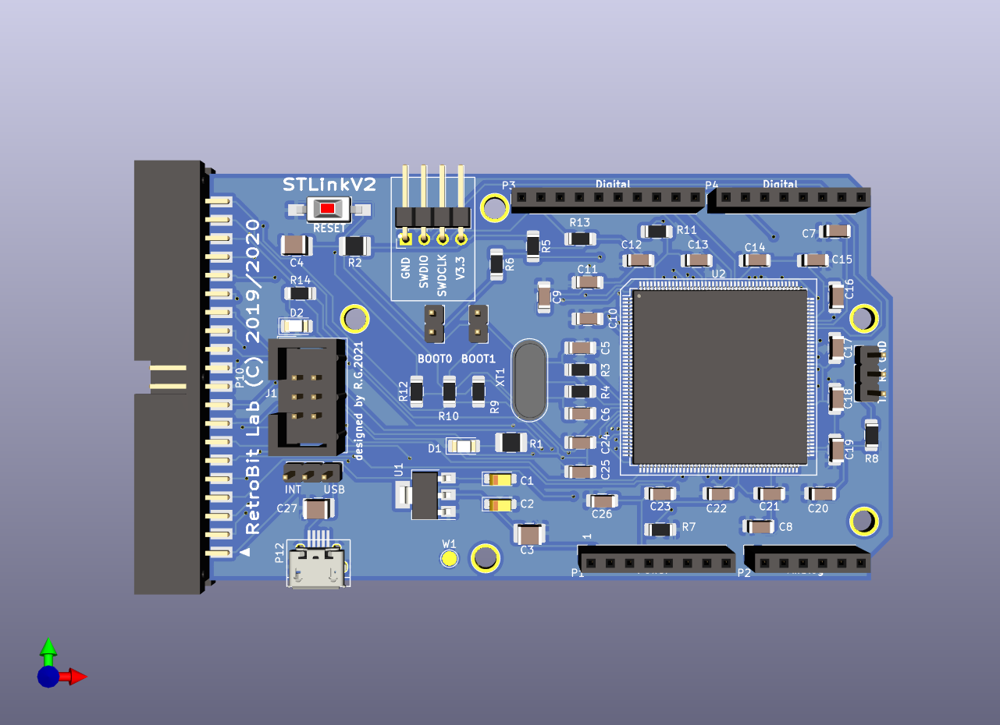
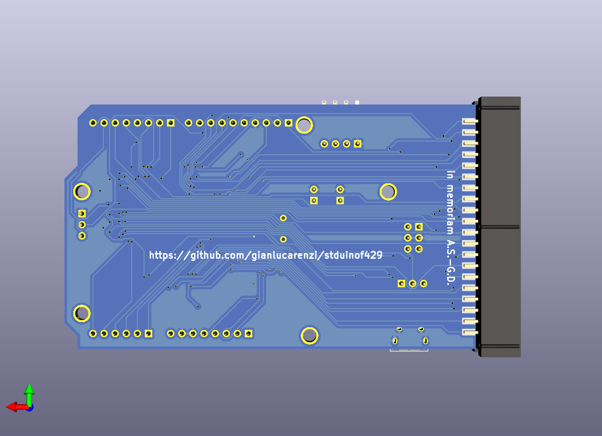
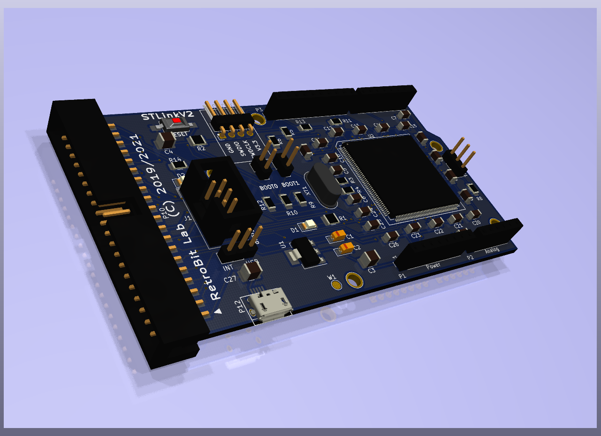

# STDuinoF429
=====================================

First attempt to have an ARDUINO (STM32 Based) Board for usage in 8-bit micros
like Atari 400/800/800XL/130XE and Commodore 64

# Rendered Images
# 
# 
# 

Hardware License
---------------------------
Copyright (C) 2018/2019 Gianluca Renzi <gianlucarenzi@eurek.it> <icjtqr@gmail.com>

The hardware of this project is released as free/open hardware under the
GNU GPL v3 License terms. See LICENSE for details.

